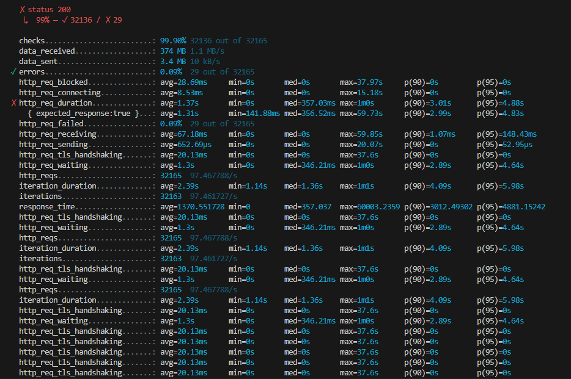
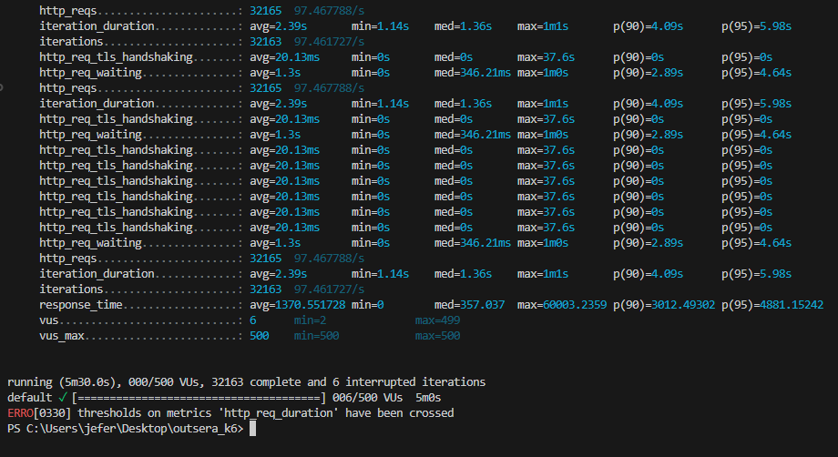

# Portifolio Jeferson Indejejczak - Performance testing

<h1>Resultado do relatório</h1>

<h1>Análise dos resultados</h1>
<h2>Taxa de sucesso dos checks:</h2>

Checks: 99.90% de sucesso.

32136 checks passados de 32165 realizados.

A taxa de falhas de apenas 0.09% (29 falhas) sugere que, em termos gerais, a API está funcionando corretamente. No entanto, é importante observar onde essas falhas ocorreram, e investigar se essas falhas ocorreram durante picos de carga ou por outros motivos.

<h2>http_req_duration (Tempo total de requisição) - Gargalo Crítico:</h2>

<li>Média: 1.37 segundos.</li>
<li>Percentil 95: 4.88 segundos.</li>
<li>Percentil 90: 3.01 segundos.</li>
<li>Máximo: 60 segundos (1 minuto).
O tempo máximo de requisição de 1 minuto (60 segundos) é um sinal claro de que a API está enfrentando problemas de desempenho severos durante picos de carga. O tempo de resposta médio e percentis também indicam que a API está levando mais tempo do que o esperado para responder a algumas requisições. Idealmente, o tempo de resposta de p(90) e p(95) deveria ser mais rápido (idealmente abaixo de 500ms a 1s, dependendo da natureza da API).

<h2>http_req_waiting (Tempo de espera até obter a resposta):</h2>

<li>Média: 1.3 segundos.</li>
<li>Percentil 95: 4.64 segundos.</li>
<li>Máximo: 60 segundos.</li>
O tempo de espera elevado, especialmente o máximo de 60 segundos, sugere que algumas requisições estão sendo bloqueadas ou demorando muito para serem processadas. Isso é um sintoma claro de um gargalo, possivelmente na camada de backend, banco de dados ou na comunicação com serviços externos.

<h2>http_req_blocked (Tempo de bloqueio na requisição):</h2>

<li>Média: 28.69 ms.</li>
<li>Máximo: 37.97 segundos.</li>l
O tempo máximo de bloqueio de 37.97 segundos é alarmante. Isso indica que, durante o teste, algumas requisições ficaram extremamente bloqueadas, aguardando algo, o que pode ter causado grandes atrasos para o usuário final.

<h2>http_req_tls_handshaking (Tempo de handshake TLS):</h2>

<li>Média: 20.13 ms.</li>
<li>Máximo: 37.6 segundos.</li>
Embora a média esteja razoável, o tempo máximo de 37.6 segundos no handshake TLS é preocupante. Isso pode ocorrer devido a problemas de configuração do servidor, como um processo de handshake TLS ineficiente ou congestionamento de conexões.

<h2>Taxa de erro (http_req_failed):</h2>

<li>0.09% de falhas (29 erros): A taxa de erro é baixa</li>

<h2>http_reqs (Número de requisições realizadas):</h2>

<li>32165 requisições feitas com 97.47 requisições por segundo.</li>
